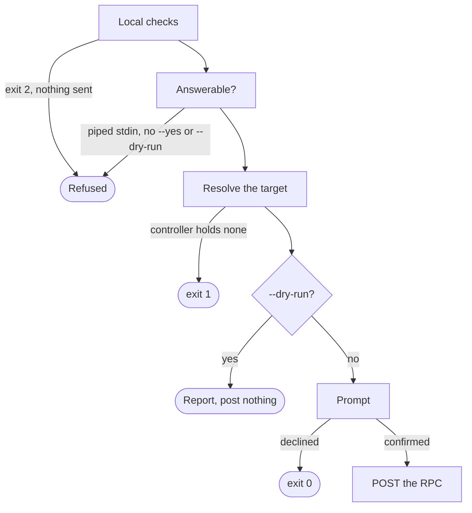

# Architecture

This document records the contracts every command keeps, and the tests an added command passes.

## Output

Every `show` command renders one row set through two writers, and both take the same selection of columns.
A [`Column[T]`](../internal/render/column.go#L13) carries the sort key, the table cell and the JSON field together, so no column exists in one writer alone.
Its [`Hidden`](../internal/render/column.go#L36) field decides whether the default set holds it.

The table is borderless and space-aligned.
It spends no column on rules and starts the first field at column zero, so `awk` and `cut` can read it.

The [`--pretty`](../internal/render/table.go#L24) form borders it and centers a glyph in each state or Boolean column instead, for a terminal rather than for a pipe.
A check marks a feature that is on or a state that is healthy, and a square marks a feature configured off.
A cross marks a fault, and a warning sign marks an access point in any state short of serving.

The [JSON form](../internal/render/json.go#L14) is a flat array whose field names come from the keys `--list-keys` prints.
A number stays a number, an empty result is `[]`, and a unit belongs to the table alone.
The table glues `dBm` to the number so a cell stays one field, while the JSON carries the bare value.

Sorting reads the typed value rather than the rendered text, so `--sort-by channel` puts 6 before 11.
A pointer column sorts through [`SortValue`](../internal/render/column.go#L74), which keeps an absence out of the ordering rather than treating it as a zero.

## Absence

A leaf missing from a controller's response is not a zero, and which of the two it is depends on the collection it came from.

On a configuration read, an omitted leaf means its schema default is in effect, and that default is often `true`.
Asking for `?with-defaults=report-all` returns the omitted leaves, and a controller that refuses the parameter answers `400`.

That parameter also returns key material, as [Measurements](measurements.md#configuration) records.
So a configuration read decodes through an allow-list that drops every leaf it does not declare.

On an operational read the same absence is structural, and materializing a default there fabricates a reading.
Absence is per leaf rather than per container.
A container can arrive with one leaf present and its sibling omitted, so a present sibling proves nothing about the one beside it.

That distinction survives or is lost in the decode layer.
A non-pointer field turns an omission into `0`, so a leaf whose zero is a real reading needs a pointer or a per-leaf guard.

The row layer then renders an absence as [`Absent`](../internal/render/column.go#L9) in the table and omits the key from the JSON.
That is why an optional field carries `omitzero` rather than `omitempty`.

> [!NOTE]
> Suppressing a value the controller did send is the mirror of inventing one.
> A reading the device CLI prints as `N/A` can still reach this CLI as a number, and [Measurements](measurements.md#radio) records which leaves those are.

## Exit Codes

One invocation answers with one code, which [`exitCode`](../internal/cli/exit.go#L25) decides from the run's outcome.

| Code | Meaning                                                        |
| :--- | :------------------------------------------------------------- |
| 0    | Every controller answered, or the prompt was declined          |
| 1    | No controller answered, or an action did not complete          |
| 2    | Usage or configuration fault. Nothing was sent to a controller |
| 3    | Partial: at least one read failed and at least one succeeded   |
| 130  | Interrupted. No partial table is printed                       |

[`ExitUsage`](../internal/cli/exit.go#L17) is decided before a request goes out, so a `2` establishes that no controller saw the invocation.
[`ExitPartial`](../internal/cli/exit.go#L18) still prints: the table holds every row that was read, and stderr names what was not.

[`ExitSignal`](../internal/cli/exit.go#L19) prints nothing at all.
The fan-out runs the controllers concurrently and renders only once every one has answered.
A table assembled from an interrupted run would report rows nobody finished reading.

An interrupt cancels the [run's context](../internal/cli/run.go#L28), and the fan-out returns that cancellation before rendering.

A read costing some cells rather than the whole row set is reported and not fatal.
The [`Degraded`](../internal/show/reporter.go#L37) path names the endpoint that failed and leaves its columns absent.
The run exits 3, not 0, because a read did fail.

## Acting on a Controller

Every command that writes runs the same sequence, and each step exists to keep a later one honest.

The local checks come first, so a missing, empty or repeated target flag is a usage fault no controller ever saw.
Naming a second controller is the same fault, because a write names one target on one controller.

The target is resolved on the controller before the prompt rather than after it.
The RPCs this CLI posts answer `204` for a target they found nothing under, exactly as they do for one they acted on.
Without that read, a reported write and a mistyped target would produce the same output.

An RPC's input is a YANG `choice`, and this documentation calls each branch of it an arm.
`reset ap` declares an `ap-name` arm and a `mac-addr` arm, and one invocation fills exactly one.

[`--dry-run`](../internal/cli/exec.go#L87) resolves the target and posts nothing.
It cannot report whether anything needed doing, and [Customization](customization.md#flags) states what it does on the root and on a `show` command.

The prompt is the last gate, and [`--yes`](../internal/cli/exec.go#L93) answers it.
With stdin piped and neither flag given the run is refused rather than assumed.
A script that has lost its terminal must not silently start writing.

Some acting leaves post an RPC declaring no output container, where a `204` establishes only that the instruction was accepted.
The rest read a result back and report what the controller said it did.

## Adding a Command

The configuration surface is closed.
It holds `set`, `delete`, `enable`, `disable` and `save-config`.
No command on that list is a precedent for the next, so adding another is the owner's decision taken again each time.

`deauth` is not one of them.
It configures nothing and the client re-associates on its own, so it leaves no state a reload would carry.
`reset` is not one either, because it posts an RPC that passes every test below.

An RPC earns a command by passing three tests.
Each is checked against the release in hand rather than inherited from its module or from `/restconf/operations`.

It must have no configuration twin, because a leaf writable through configuration belongs there.
It must leave no `running-config` line, because a line the device prints is one an operator can already set.
It must declare no `output` container, because an RPC answering with a result is reporting rather than acting.

The `running-config` test is not enough alone.
Per-AP configuration keys on the dotted MAC, so a filter on the name returns nothing whether or not the feature is configurable.

A pass allows the command and not its placement.
A `reset` leaf names one access point by its key, so the command carrying it names one access point too.

`save-config` fails the `output` test and is on the list anyway.
It declares an `output` container and exists to persist, which is the exception the owner took deliberately.
Every reading these rules rest on sits in [Measurements](measurements.md).
